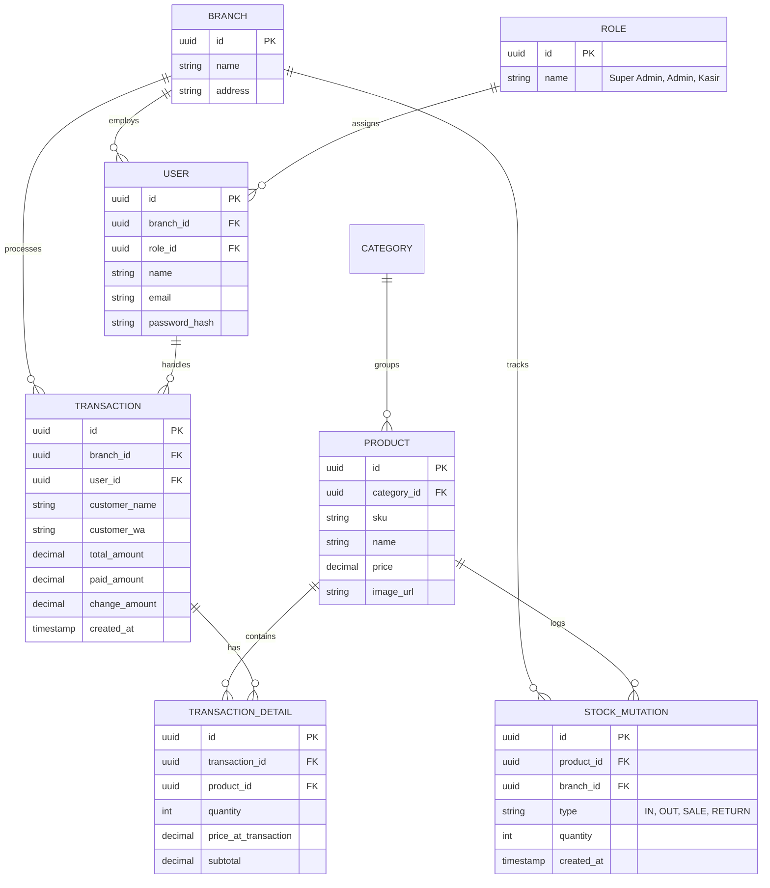

Sekarang kita sampai di bagian paling krusial dalam perancangan sistem: **Sub-bab 2.4**. ERD adalah "peta jalan" bagi data Anda. Jika rancangan ini salah, maka fitur *multi-cabang* dan *manajemen stok* Anda akan sulit diimplementasikan di kemudian hari.

Silakan buat file **`docs/02-04-perancangan-erd.md`** dan masukkan konten perancangan berikut:

---

# 2.4 Perancangan Database (ERD)

Entity Relationship Diagram (ERD) adalah representasi visual dari tabel-tabel di database dan bagaimana mereka saling berhubungan. Untuk sistem POS *enterprise* ini, kita menggunakan pendekatan yang mendukung **Multi-Cabang** dan **Log Mutasi Stok**.


## Diagram ERD (Mermaid)

Berikut adalah struktur hubungan antar tabel yang akan kita bangun menggunakan Prisma ORM nanti:



## Penjelasan Relasi Kunci

### 1. Multi-Cabang (Multi-Branch Isolation)

Hampir semua tabel utama (`User`, `Transaction`, `Stock_Mutation`) memiliki kolom `branch_id`. Ini memungkinkan kita untuk memfilter data dengan sangat cepat: *"Tampilkan hanya transaksi milik Cabang A"*.

### 2. Log Mutasi Stok (Inventory Ledger)

Kita tidak hanya menyimpan kolom "stok_saat_ini" di tabel produk. Mengapa? Karena itu rawan manipulasi dan sulit dilacak.

* Setiap ada barang masuk atau terjual, kita mencatatnya di `STOCK_MUTATION`.
* Stok akhir dihitung dari total mutasi masuk dikurangi mutasi keluar. Ini jauh lebih akurat untuk audit.

### 3. Keamanan UUID

Kita menggunakan `UUID` daripada `Integer (Serial)` untuk Primary Key.

* **Alasan:** Memudahkan fitur **Offline-First**. Kasir bisa membuat transaksi di lokal dengan ID unik tanpa takut bentrok dengan ID yang dibuat oleh cabang lain saat data disinkronkan ke server.

### 4. Harga Statis di Detail Transaksi

Perhatikan kolom `price_at_transaction` di `TRANSACTION_DETAIL`.

* **Alasan:** Harga produk bisa berubah di masa depan. Jika kita tidak menyimpan harga saat transaksi terjadi, maka laporan pendapatan lama kita akan ikut berubah mengikuti harga produk yang baru. Ini adalah prinsip dasar akuntansi digital.

---

```

---

### Apa yang Harus Anda Lakukan Sekarang?
1.  Simpan file ini di folder `docs`.
2.  Coba baca kembali diagramnya di GitHub (GitHub secara otomatis merender kode `mermaid` menjadi gambar diagram yang cantik).

**Bab 2 selesai!** Kita sudah punya mesin database dan rancangan petanya. 

**Siap lanjut ke Bagian 2, Bab 3 (Sub-bab 3.1)?** Kita akan mulai menyentuh kode program sesungguhnya: **Setup Project Express.js dengan TypeScript.** Inilah saatnya kita membangun "Pondasi Bangunan" backend Anda.

```